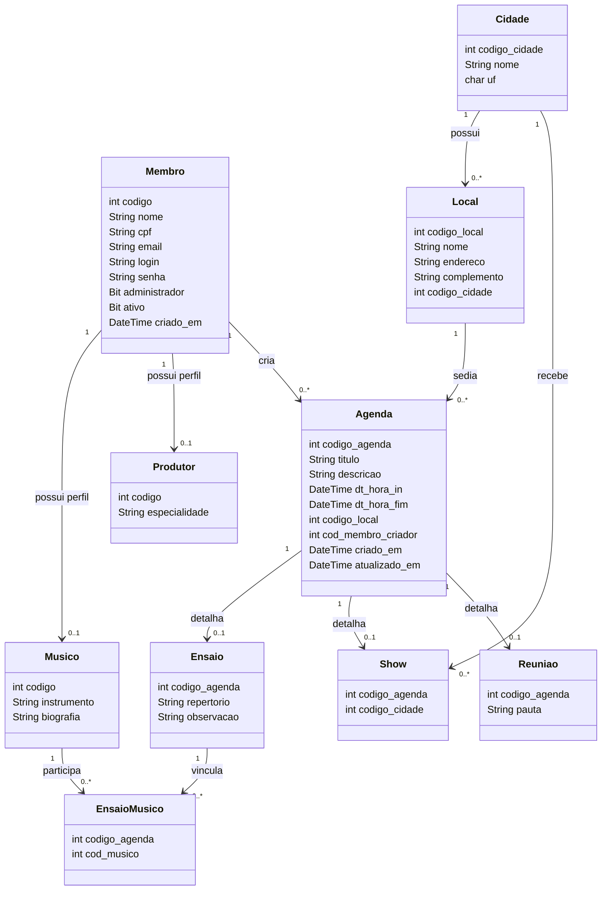

# Diagrama de classe

```mermaid
classDiagram
    class Membro {
        int codigo
        String nome
        String cpf
        String email
        String login
        String senha
        Bit administrador
        Bit ativo
        DateTime criado_em
    }

    class Musico {
        int codigo
        String instrumento
        String biografia
    }

    class Produtor {
        int codigo
        String especialidade
    }

    class Cidade {
        int codigo_cidade
        String nome
        char uf
    }

    class Local {
        int codigo_local
        String nome
        String endereco
        String complemento
        int codigo_cidade
    }

    class Agenda {
        int codigo_agenda
        String titulo
        String descricao
        DateTime dt_hora_in
        DateTime dt_hora_fim
        int codigo_local
        int cod_membro_criador
        DateTime criado_em
        DateTime atualizado_em
    }

    class Ensaio {
        int codigo_agenda
        String repertorio
        String observacao
    }

    class Show {
        int codigo_agenda
        int codigo_cidade
    }

    class Reuniao {
        int codigo_agenda
        String pauta
    }

    class EnsaioMusico {
        int codigo_agenda
        int cod_musico
    }

    Membro "1" --> "0..1" Musico : possui perfil
    Membro "1" --> "0..1" Produtor : possui perfil
    Membro "1" --> "0..*" Agenda : cria
    Cidade "1" --> "0..*" Local : possui
    Cidade "1" --> "0..*" Show : recebe
    Local "1" --> "0..*" Agenda : sedia
    Agenda "1" --> "0..1" Ensaio : detalha
    Agenda "1" --> "0..1" Show : detalha
    Agenda "1" --> "0..1" Reuniao : detalha
    Ensaio "1" --> "0..*" EnsaioMusico : vincula
    Musico "1" --> "0..*" EnsaioMusico : participa
```
